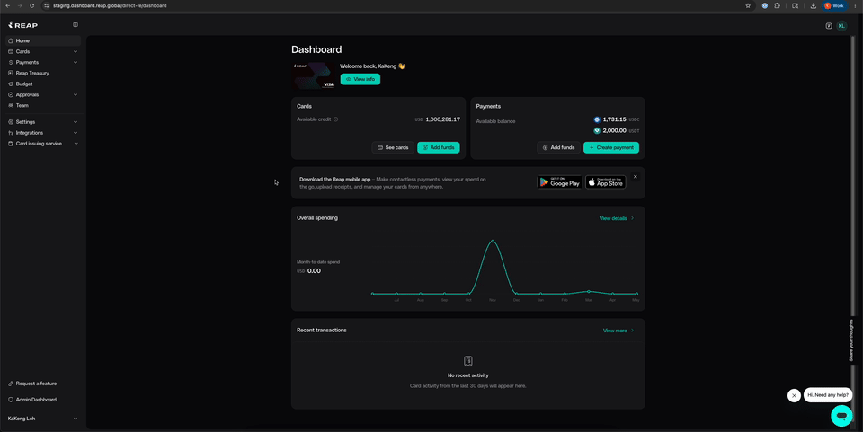

# Reap Preview Auth

Chrome extension that copies `access_token` and `refresh_token` from a logged-in staging tab into Reap Netlify deploy preview tabs.



## Install

1. Open `chrome://extensions`.
2. Enable Developer mode.
3. Click Load unpacked.
4. Select the cloned repository directory.

## Usage

1. Open `https://staging.dashboard.reap.global/` and log in.
2. Open a deploy preview URL like `https://deploy-preview-1031--reapdirect.netlify.app/login`.
3. The extension copies tokens into the preview tab's `localStorage` and reloads the preview once.
4. When the preview tab closes, the latest preview tokens are copied back into any open staging tab.

If tokens are not cached yet, the preview tab asks the background service worker to harvest them from an already-open staging tab.

If staging is not open when the preview tab closes, the latest preview tokens are saved and applied the next time staging opens.

## Scope

The extension only writes tokens when the preview hostname matches:

```text
deploy-preview-<number>--reapdirect.netlify.app
```

Token values are not logged.
